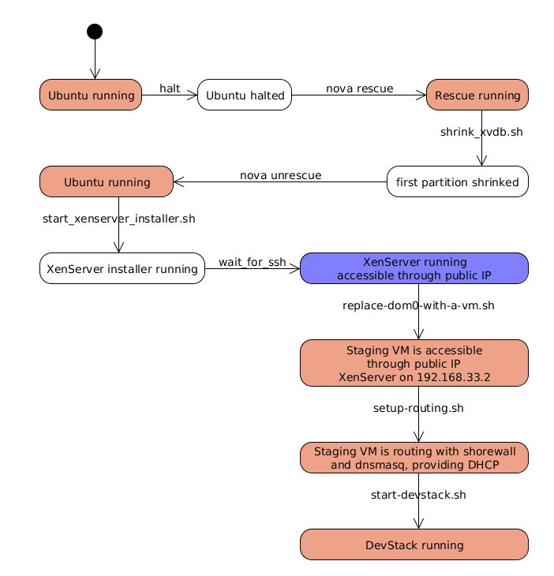

xenapi-in-the-cloud
===================

Tools to run a XenAPI managed hypervisor in the cloud

## Start XenServer in the Rackspace cloud

To launch an instance, first make sure, that you have `nova` installed, and
that your environment has all the settings. For setting up your environment
and nova, please refer to [the official Rackspace documentation](http://docs.rackspace.com/servers/api/v2/cs-gettingstarted/content/section_gs_install_nova.html).

You will need to come up with a password that will be used for your XenServer.
In this case, I will use `xspassword`.

With all the parameters, the command should look like this:

    ./rs-xenserver.sh "xs62" "xspassword" first-cloud-boot/xenserver-firstboot-access-dom0.sh

## Start XenServer with a Staging VM

    ./rs-xenserver.sh "xs62" "xspassword" first-cloud-boot/xenserver-firstboot-access-staging-vm.sh
